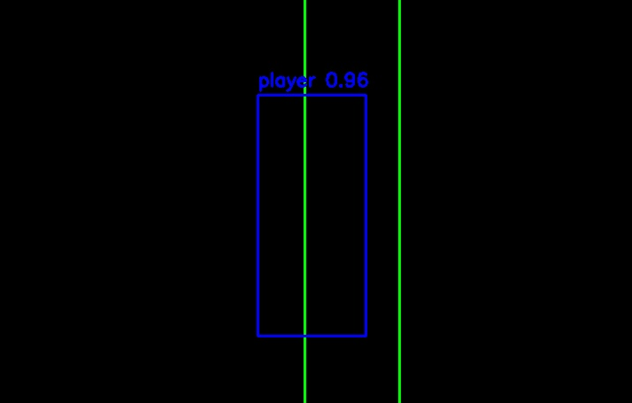
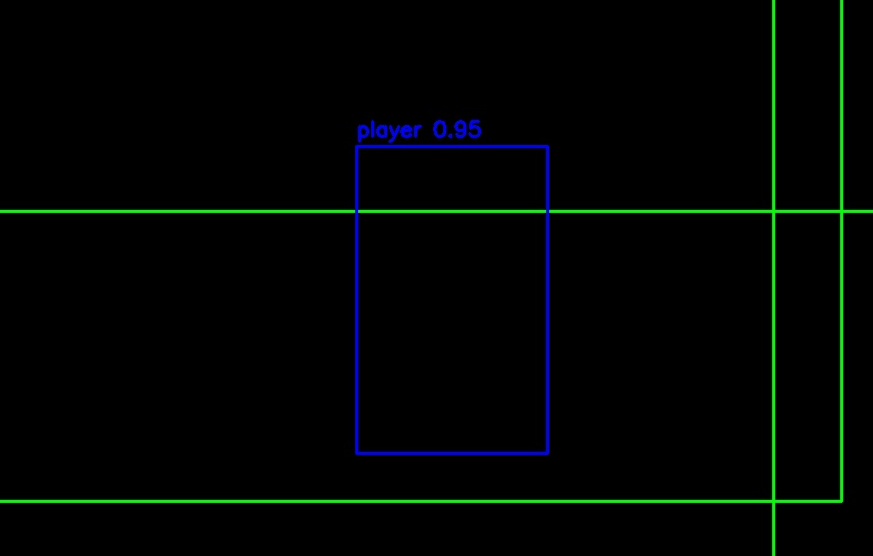
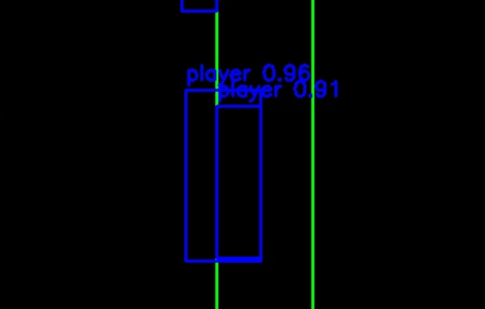
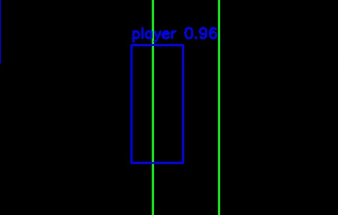

# Bounding boxes Filter with ROI-NMS

В main.py реализован алгоритм NMS на основе области интереса (ROI).


Алгоритм обрабатывает каждый кадр независимо:

1. Группирует детекции по кадрам
2. Применяет NMS с учетом:
   - IoU между bounding boxes
   - Принадлежности к общим ROI

**Визуализация работы для кадра 7951:**

| До фильтрации                               | После фильтрации                           |
|---------------------------------------------|--------------------------------------------|
|  |  |
|  |  |
|  |  |


## Usage
```bash
python main.py --input 7b96f3df-d8f8-4cdc-a106-6adadbf6593b_sample.json